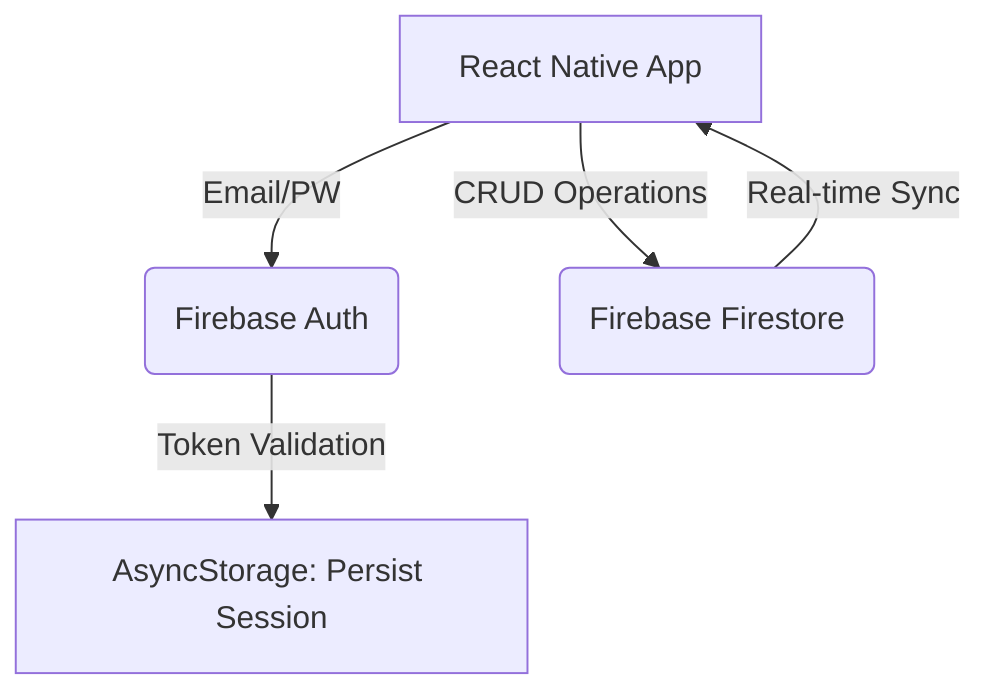

# 💳 WalletSync
> A cross-platform mobile coupon wallet app built to store, track, and synchronize coupons with real-time cloud data.

[](https://opensource.org/licenses/MIT)

## 💡 Motivation (The Problem)
- **Scattered Assets**: Gifticons and barcode coupons are often lost in the photo gallery or forgotten in chat rooms.
- **Missed Deadlines**: Users frequently forget expiry dates, leading to expired and wasted financial value.

## 🎯 Solution (What it does)
- Centralized wallet to add, view, and track coupons with brand names, barcodes, and expiry dates.
- Secure user authentication and persistent sessions.
- Real-time cloud sync ensures your coupons are never lost, even if you change devices.

### 📩 Example Output
*(Add screenshot of the Home Screen and Add Coupon Screen here)*

## 🏗️ Architecture & Data Flow



### 📁 Project Structure
```text
wallet-sync/
├── App.js                        # Root component, auth-based navigation
├── src/
│   ├── screens/
│   │   ├── auth/                 # Login & Registration screens
│   │   └── home/                 # Coupon list & Add form screens
│   └── services/
│       ├── firebase.js           # Firebase app initialization
│       ├── authService.js        # Auth helpers (login, signup, logout)
│       └── firestoreService.js   # Firestore CRUD operations
```

### 📱 Screens & Flow
- **Auth Flow**: Login, Register
- **App Flow**: Home (List view), Add Coupon (Form)

## 🛠️ Tech Stack & Decisions

| Component | Choice | Why this over alternatives? |
| --------- | ------ | --------------------------- |
| **Framework** | React Native (Expo) | Allows building for iOS, Android, and Web simultaneously with a single JS codebase. |
| **Backend** | Firebase | Provides out-of-the-box Auth and real-time NoSQL (Firestore) syncing without backend deployment. |
| **State Persistence**| AsyncStorage | Lightweight, standard solution to preserve login states locally across app restarts. |

## 🚀 Quick Start (Setup)

### 🔧 Firebase Console Setup
1. Create a project in [Firebase Console](https://console.firebase.google.com/).
2. Enable **Email/Password** authentication under *Authentication*.
3. Create a **Firestore Database** and add a `coupons` collection.

### 💻 Local Installation
1. Prerequisites: Node.js (>= 20) and Expo CLI.
2. Clone the repository and install dependencies:
   ```bash
   git clone https://github.com/liminal-cipher/wallet-sync.git
   cd wallet-sync
   npm install
   ```
3. Create a `.env` file for Firebase credentials:
   ```env
   EXPO_PUBLIC_FIREBASE_API_KEY=...
   EXPO_PUBLIC_FIREBASE_AUTH_DOMAIN=...
   EXPO_PUBLIC_FIREBASE_PROJECT_ID=...
   ```
4. Run the development server:
   ```bash
   npm start
   ```

## 📈 Roadmap & Maintenance
- **Push Notifications**: Integrate Expo Push Notifications to alert users 3 days before a coupon expires.
- **OCR Integration**: Implement camera-based barcode scanning and text extraction to auto-fill coupon details.
- **Sharing Capabilities**: Allow sending coupons securely to other registered users via deep linking.

## 📄 License
This project is licensed under the MIT License - see the [LICENSE](LICENSE) file for details.
