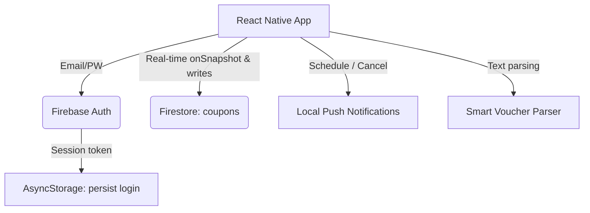

# WalletSync

> A cross-platform coupon wallet that tracks voucher expiry dates and renders scannable barcodes.

[](https://opensource.org/licenses/MIT)


## Motivation

Gift vouchers arrive as images in chat rooms and end up buried in the camera roll. The gallery does not know that a picture is worth money, so it cannot sort by expiry date, cannot tell which ones are already spent, and cannot warn that one runs out this week. The value quietly expires.

WalletSync treats a coupon as a record instead of a photo: it has a brand, a barcode, an expiry date, and a used-or-not state, and those are the four things the app is built around.

## What It Does

- Register and sign in with email and password, with the session restored on relaunch
- Add a coupon via camera barcode scanning, smart text parsing, quick presets, or manual input
- Browse coupons sorted by expiry, nearest first
- Real-time Firestore sync across devices with pull-to-refresh fallback
- Render scannable Code 128 barcodes directly on cards with tap-to-enlarge modal for checkout counters
- Schedule local push notifications for D-7, D-3, and D-Day expiry alerts
- See a status badge on each card: expired, due today, or days remaining
- Mark a coupon used, or bring it back to active
- Delete a coupon behind a confirmation prompt
- Filter the list by all, active, or used

The interface is in Korean. Each account only ever loads its own coupons.

## Architecture


```mermaid
graph TD
    A[React Native App] -->|Email/PW| B(Firebase Auth)
    B -->|Session token| C[AsyncStorage: persist login]
    A -->|Real-time onSnapshot & writes| D(Firestore: coupons)
    A -->|Schedule / Cancel| E[Local Push Notifications]
    A -->|Text parsing| F[Smart Voucher Parser]
```

Coupon state is synced via Firestore `onSnapshot` real-time listeners, with pull-to-refresh (`RefreshControl`) as a manual fallback.

```text
wallet-sync/
├── App.js                        # Root component, auth-based navigation
├── firestore.rules               # Firestore security rules
├── src/
│   ├── components/
│   │   └── BarcodeRenderer.js    # Code 128 barcode generator
│   ├── screens/
│   │   ├── auth/                 # Login, Register
│   │   └── home/                 # Coupon list, Add coupon form
│   ├── services/
│   │   ├── authService.js        # Login, signup, logout helpers
│   │   ├── firebase.js           # Firebase app and service initialization
│   │   ├── firestoreService.js   # Firestore CRUD & onSnapshot real-time sync
│   │   └── notificationService.js# Expiry notification scheduling
│   └── utils/
│       ├── authUtils.js          # Localized error code mappings
│       ├── barcodeEncoder.js     # Code 128 encoding patterns
│       ├── dateUtils.js          # Expiry D-day calculations & sorting
│       └── voucherParser.js      # Smart gifticon text/brand/date extraction
└── tests/
    ├── auth.test.js              # Auth error mapping tests
    ├── barcode.test.js           # Barcode encoding unit tests
    ├── date.test.js              # Expiry date & sorting unit tests
    └── voucherParser.test.js     # Smart voucher parser unit tests
```

## Tech Decisions

| Component | Choice | Why this over alternatives |
| --- | --- | --- |
| Framework | React Native (Expo) | One JS codebase reaches iOS, Android, and the browser, and Expo removes the native build step from a solo project |
| Backend | Firebase | Auth and a hosted datastore without deploying or paying for a server |
| Real-time sync | Firestore `onSnapshot` | Instant multi-device synchronization and reactive UI updates without manual polling |
| Session persistence | AsyncStorage via `getReactNativePersistence` | React Native has no browser storage, so Firebase Auth needs an explicit persistence adapter or the user is logged out on every relaunch |
| Notifications | `expo-notifications` (over remote push server) | Scheduled local notifications trigger on-device without requiring a custom push server or persistent backend worker |
| Barcode scanning & Smart Parsing | `expo-camera` + Smart Regex Parser | Client-side barcode scanning combined with deterministic Korean gifticon brand, PIN, and date extraction without third-party cloud OCR costs or network latency |
| Sorting | In memory, after fetch/sync | Sorting by expiry inside a `where("userId", ...)` query would require a Firestore composite index. At one user's coupon count, sorting client-side costs nothing and keeps setup to zero configuration |
| Config | `EXPO_PUBLIC_*` environment variables | Firebase client config ships to the device by design, so the point is keeping project identifiers out of the repository, not keeping them secret |

## Results & Limitations

The app has been exercised by hand on a single account, and core business utilities are validated with automated Jest unit tests (`npm test`).

- **Data isolation is defined in `firestore.rules`.** Queries filter by `userId`, and the repository contains version-controlled Firestore security rules enforcing document ownership boundaries.
- **Real-time synchronization.** Coupon additions, status updates, and deletions reflect instantly across active devices via Firestore snapshot listeners.
- **Smart voucher text parsing.** Parses pasted KakaoTalk gifticon, Giftishow, SMS, or OCR-produced text to fill brand, PIN, and expiry date.
- **Expiry reminders run locally.** Notifications are scheduled on device at D-7, D-3, and D-Day morning, closing the loop on voucher expiration.
- **Barcodes are rendered as Code 128 barcodes.** Card-level barcodes dynamically scale to container constraints, and tap-to-enlarge modals provide high-contrast display for POS scanners.
- Gallery selection currently does not run OCR or persist the selected image; metadata extraction requires text input.`n- Expiry handling uses the device's local date with no timezone normalization.

## Getting Started

### Firebase Console Setup

1. Create a project in the [Firebase Console](https://console.firebase.google.com/).
2. Enable **Email/Password** authentication under Authentication.
3. Create a **Firestore Database** with a `coupons` collection.
4. Deploy the security rules from `firestore.rules` to restrict document access to the authenticated owner.

### Local Installation

Prerequisites: Node.js 20 or later, and Expo CLI.

```bash
git clone https://github.com/liminal-cipher/wallet-sync.git
cd wallet-sync
npm install
```

Create a `.env` file with the Firebase web config:

```env
EXPO_PUBLIC_FIREBASE_API_KEY=...
EXPO_PUBLIC_FIREBASE_AUTH_DOMAIN=...
EXPO_PUBLIC_FIREBASE_PROJECT_ID=...
EXPO_PUBLIC_FIREBASE_STORAGE_BUCKET=...
EXPO_PUBLIC_FIREBASE_MESSAGING_SENDER_ID=...
EXPO_PUBLIC_FIREBASE_APP_ID=...
```

Then start the development server or run unit tests:

```bash
npm test       # run Jest unit test suite (34 passed)
npm start      # device or emulator via Expo Go
npm run web    # browser, via react-native-web
```

## Roadmap

- [x] **Real-time Firestore sync**: Real-time snapshot listener for multi-device instant synchronization.
- [x] **Smart voucher parser & extractor**: Automatic parsing of brand, barcode PIN, and expiry date from voucher text/OCR.
- [ ] **Cloud backup & export**: PDF / CSV export for offline backup.

## Status

Active. Real-time multi-device sync implemented. Last updated 2026-09-01.

## License

MIT. See [LICENSE](LICENSE).
