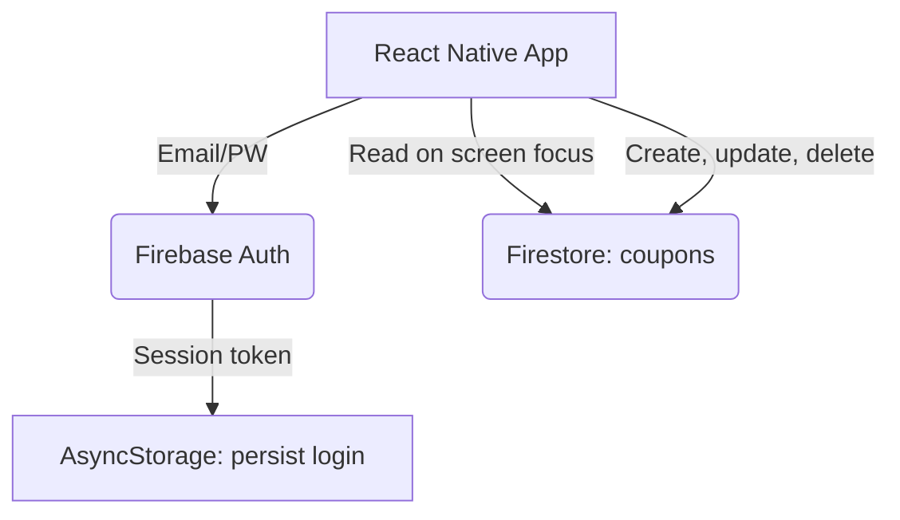

# WalletSync

A cross-platform mobile coupon wallet that keeps gift vouchers and barcode coupons in one place and tracks how close they are to expiring.

[](https://opensource.org/licenses/MIT)


## Motivation

Gift vouchers arrive as images in chat rooms and end up buried in the camera roll. The gallery does not know that a picture is worth money, so it cannot sort by expiry date, cannot tell which ones are already spent, and cannot warn that one runs out this week. The value quietly expires.

WalletSync treats a coupon as a record instead of a photo: it has a brand, a barcode, an expiry date, and a used-or-not state, and those are the four things the app is built around.

## What It Does

- Register and sign in with email and password, with the session restored on relaunch
- Add a coupon with brand, barcode number, and expiry date via quick presets or custom date input
- Browse coupons sorted by expiry, nearest first
- Render scannable Code 128 barcodes directly on cards with tap-to-enlarge modal for checkout counters
- See a status badge on each card: expired, due today, or days remaining
- Mark a coupon used, or bring it back to active
- Delete a coupon behind a confirmation prompt
- Filter the list by all, active, or used

The interface is in Korean. Each account only ever loads its own coupons.

## Architecture


```mermaid
graph TD
    A[React Native App] -->|Email/PW| B(Firebase Auth)
    B -->|Session token| C[AsyncStorage: persist login]
    A -->|Read on screen focus| D(Firestore: coupons)
    A -->|Create, update, delete| D
```

Reads happen when a screen gains focus rather than through a live listener, so the list refreshes on navigation and after every write.

```text
wallet-sync/
├── App.js                        # Root component, auth-based navigation
├── firestore.rules               # Firestore security rules
├── src/
│   ├── components/
│   │   └── BarcodeRenderer.js    # Code 128 barcode generator
│   ├── screens/
│   │   ├── auth/                 # Login, Register
│   │   └── home/                 # Coupon list, Add coupon form
│   └── services/
│       ├── firebase.js           # Firebase app and service initialization
│       ├── authService.js        # Login, signup, logout helpers
│       └── firestoreService.js   # Firestore CRUD
```

## Tech Decisions

| Component | Choice | Why this over alternatives |
| --- | --- | --- |
| Framework | React Native (Expo) | One JS codebase reaches iOS, Android, and the browser, and Expo removes the native build step from a solo project |
| Backend | Firebase | Auth and a hosted datastore without deploying or paying for a server |
| Session persistence | AsyncStorage via `getReactNativePersistence` | React Native has no browser storage, so Firebase Auth needs an explicit persistence adapter or the user is logged out on every relaunch |
| Sorting | In memory, after fetch | Sorting by expiry inside a `where("userId", ...)` query would require a Firestore composite index. At one user's coupon count, sorting client-side costs nothing and keeps setup to zero configuration |
| Config | `EXPO_PUBLIC_*` environment variables | Firebase client config ships to the device by design, so the point is keeping project identifiers out of the repository, not keeping them secret |

## Results & Limitations

No performance or usage numbers have been measured. The app has been exercised by hand on a single account, and there are no automated tests.

- **Data isolation is defined in `firestore.rules`.** Queries filter by `userId`, and the repository contains version-controlled Firestore security rules enforcing document ownership boundaries.
- **There is no real-time sync.** The list is fetched on screen focus, so a change made on another device appears on the next navigation, not immediately.
- **Nothing reminds the user.** Expiry is visible only while the app is open, which leaves the original problem, forgetting, partly unsolved.
- Barcodes are rendered as Code 128 barcodes with tap-to-enlarge modal support for retail POS scanners.
- Expiry handling uses the device's local date with no timezone normalization.

## Getting Started

### Firebase Console Setup

1. Create a project in the [Firebase Console](https://console.firebase.google.com/).
2. Enable **Email/Password** authentication under Authentication.
3. Create a **Firestore Database** with a `coupons` collection.
4. Deploy the security rules from `firestore.rules` to restrict document access to the authenticated owner.

### Local Installation

Prerequisites: Node.js 20 or later, and Expo CLI.

```bash
git clone https://github.com/liminal-cipher/wallet-sync.git
cd wallet-sync
npm install
```

Create a `.env` file with the Firebase web config:

```env
EXPO_PUBLIC_FIREBASE_API_KEY=...
EXPO_PUBLIC_FIREBASE_AUTH_DOMAIN=...
EXPO_PUBLIC_FIREBASE_PROJECT_ID=...
EXPO_PUBLIC_FIREBASE_STORAGE_BUCKET=...
EXPO_PUBLIC_FIREBASE_MESSAGING_SENDER_ID=...
EXPO_PUBLIC_FIREBASE_APP_ID=...
```

Then start the development server:

```bash
npm start      # device or emulator via Expo Go
npm run web    # browser, via react-native-web
```

## Roadmap

- **Expiry notifications**: Expo Push Notifications a few days before a coupon runs out. This is the feature that closes the loop on the motivation.
- **Barcode scanning**: camera capture with OCR to fill in brand, number, and expiry instead of typing them.

## Status

In development. Last updated 2026-08-31.

## License

MIT. See [LICENSE](LICENSE).

